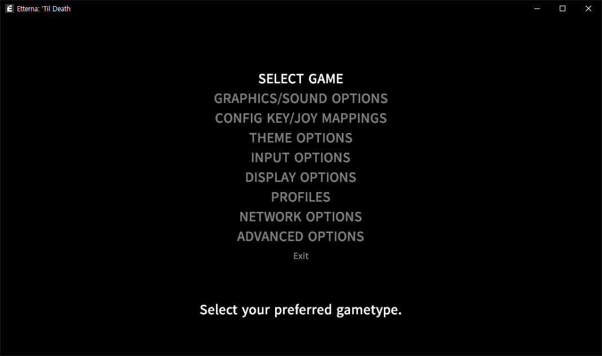

# Introduction-Etterna(이터나 입문서)

Reworking Sistia 이터나 입문서(kr)

## 목차

0. 이터나의 장단점
1. 다운로드
    1. 운영체제 확인
    2. 설치법
2. 아이디 생성
3. 이터나 옵션 설명
    1. 그래픽 옵션
    2. 키 컨픽 옵션
4. 로컬 프로필 생성
    1. 로컬 프로필과 온라인 프로필의 차이점  
5. 팩 다운로드
    1. 팩추천
    2. 팩 압축해제 경로
6. 스킨 다운로드
    1. 노트스킨
    2. 추천 노트스
    3. 추천 판정스킨
7. 게임정보
    1. 선곡창
    2. 인게임
    3. 인게임 옵션
    4. 리절트창, 스크린샷
    5. 정확도
    6. 온라인 점수

### 0. 이터나의 장단점

#### 장점

1. 오스랑 다르게 대부분이 랭크곡 -> 연습하면서 파밍 가능
2. 퍼즈기능이 없어 체력 늘리기 좋음
3. 말리기 시작하면 답도 없지만, 말릴때 대처능력을 길러준다.
4. 오스와 다르게 이터나는 인게임에서 곡 레이트를 조절할 수 있다.  

#### 단점

1. 오스와 달리 확도 체계가 달라 적응하기 전까지 스트레스를 받을 수 있음(자세한건 7-5로)

### 1. 다운로드

#### 1-1. 운영체제 확인

이터나를 받기 전에 컴퓨터 운영체제 비트수 확인이 필요합니다.  
혹시 모르시는 분은 아래 주소를 참고해주세요.

[윈도우 운영체제 확인하는법](https://prolite.tistory.com/1442)  

### 2. 설치법

아래 주소는 이터나 홈페이지 주소입니다.  

> etternaonline.com

  

Download 버튼을 누르시면 여러 운영체제 버전 / 비트수가 나오는데,  
아까 확인했던 운영체제 비트수에 맞는 버튼을 눌러 받아주세요.


다운받은 파일을 실행시키시면 이런 창이 뜨는데,  
그냥 평소 프로그램 설치하듯 설치하시면 됩니다.  

  

### 2. 아이디 생성

이터나를 설치했으니 계정 만들차례입니다 :)  

이터나 계정은 사이트 우측 상단에 있는 Login 버튼을 누르시면,  
아래와 같은 창이 뜨는데 계정을 만들기 위해 **create an account** 를 클릭해줍니다.

  b

클릭을 하시면 아래와 같은 창이 뜨는데,  
각 입력창에 넣어야할 값은 다음과 같습니다.


- Username : 사용자 아이디, 인게임에서 나오는 플레이어 닉네임
- Email Address : 이메일 주소
- Password / Confirm Password : 계정 비밀번호, 비밀번호 확인
- Country : 국가 선택(아무 나라나 상관없음.)
  
다 입력 하셨으면 Register 버튼을 누르시고,  
계정에 사용한 이메일계정으로 가셔서 확인 이메일을 확인해주세요.

### 3. 이터나 옵션 설명

계정을 만들었으니 게임 설정에 대하여 알아봅시다 :)  

게임을 실행하면 아래와 같은 화면이 나옵니다.  
일단 메인화면에서 3번째에 있는 **Option** 쪽을 알아보겠습니다.  


Option은 아래와 같이 나오는데,  
그중에 GRAPHICS/SOUND OPTIONS, CONFIG KEY/JOY MAPPINGS을 알아보겠습니다.



#### 3-1. 그래픽 옵션

GRAPHICS/SOUND OPTIONS 을 선택하시면 아래와 같은 화면이 나옵니다.  
몰라도 되는것들을 제외하고 딱 필요한 것은 4가지입니다.


1. DISPLAY MODE : 전체화면으로 할건지, 창모드로 할건지 여부
2. DISPLAY RESOULUTION : 화면 해상도
3. SOUND VOLUME : 이터나 소리 조절, 기본적으로 소리가 크기때문에 **10~20% 추천**
4. MINE SOUNDS : 이터나 할때 뜨는 폭탄 소리를 활성화 할건지 여부

#### 3-2. 키 컨픽 옵션

CONFIG KEY/JOY MAPPINGS 에 들어가시면 아래와 같은 화면이 나옵니다.


각 키의 기능을 설명하겠습니다.

- Start : 오스의 Enter기능과 비슷함
- Select : 0.05x 단위의 배속을 조절할때 필요한 키
- Back : 오스의 esc와 같은 기능.  
  다만 일시정지 기능이 없기 때문에, 게임도중 esc를 누르면 선곡창으로 나가짐

- Insert Coin, Operator : 의미없음.
- EffectUp : 0.1x 단위의 배속을 올릴 수 있는 키
- EffectDown : 0.1x 단위의 배속을 내릴 수 있는 키
- RestartGamePlay : 오스의 리트라이와 같은 기능
- Left : 4키 키배치 기준 왼쪽에서 첫번째
- Right : 4키 키배치 기준 가장 오른쪽
- Up : 4키 키배치 기준 왼쪽에서 3번째
- Down : 4키 키배치 기준 왼쪽에서 두번째

이정도입니다. 키배치를 설정할때 주의할 점은 오스처럼 순서대로가 아니라,  
Left / Down / Up / Right 순으로 설정하셔야합니다.

키 설정방법은 원하는 기능 라인에 부분에 ------ 되어있는곳에 엔터를 누르고  
원하는 키를 입력하시면 해당 기능이 원하는 키로 설정 됩니다.

### 4. 로컬 프로필 생성

로컬 프로필을 만들어 개인기록을 저장해봅시다. :)  

게임 키설정까지 마치셨으면 이젠 프로필을 만들 차례입니다.  
메인화면에서 `Options -> Profiles -> Create Profile` 순으로 가시면 만들 수 있습니다.  
Create Profile을 누르시고 원하시는 이름을 입력하시면 됩니다.  
(위 과정은 이미 만들었으면 안 만들어도 됨)  

#### 4-1. 로컬 프로필과 온라인 프로필의 차이점

이터나도 오스와 같이 PP 시스템과 같은 점수 시스템이 있습니다.  

다만 다른점은  
이터나에서 로컬프로필은 너프 안한 점수 & 플레이한 곡들이 점수로 반영이 되고,  
100개든 200개든 모두 점수가 저장되는 반면  


온라인 프로필은 로컬프로필과 달리 너프된 점수를 반영합니다.  
또한 점수 너프를 엄청 적용하는 곡들도 존재합니다.

온라인 프로필은 아래와 같이 나오며, TOP 25 점수 까지만 나옵니다.  
보는법은 왼쪽부터 `곡이름 -> 배속 -> 점수 -> 너프후 점수` 순입니다.  

  

### 5. 팩 다운로드

이터나 인게임에는 팩 다운로더가 기본적으로 존재하고, 아래와 같이 생겼습니다.  


오스로 치면 다이렉트 다운로드 같은 기능인데 **사용하지 않으시는 것을 추천합니다.**

파일 깨짐, 곡 누락 등과 같은 여러가지 문제점이 자주 발생하기 때문입니다.

위와 같은 이유로 이터나에서 팩을 받으실때는 [공식 홈페이지](https://etternaonline.com/packs)에서 주소에서 받는 것을 권장드립니다.  

#### 5-1. 팩추천

아래 팩 목록은 오스에 있는 곡들 있는 팩이랑, 여러 사람이 추천하는 팩 링크입니다.

Nuclear Blast JS Series.  
[Nuclear Blast JS Awesome Bomb Filez 4](https://etternaonline.com/pack/58)  
[Nuclear Blast JS Awesome Bomb Filez 5](https://etternaonline.com/pack/4327)  

[Nuclear Kimchi Chordjack Pack](https://etternaonline.com/pack/56153)  
[10Dollar Dump Dump Revolutions 2](https://etternaonline.com/pack/1)  

Jumpstream Of Fighters Series.  
[Jumpstream Of Fighters Vol. 1](https://etternaonline.com/pack/52)  
[Jumpstream Of Fighters Vol. 2](https://etternaonline.com/pack/8656)  

ATTang Series.  
[ATTang’s Bad Files](https://etternaonline.com/pack/13)  
[ATTangs Dumpmix](https://etternaonline.com/pack/14)  

Skwid's Minipack Series.  
[Skwid’s Minipack 2 (Zenith Eoe Edition)](https://etternaonline.com/pack/7858)  
[Skwid’s Minipack 3 (Metamemes And More Anime Edition)](https://etternaonline.com/pack/7874)  
[Skwid’s Minipack 4 U (Big Guy Edition)](https://etternaonline.com/pack/7891)  
[Skwid’s Minipack 5 (Edition)](https://etternaonline.com/pack/7906)  
[Skwid’s Minipack 6 (Cute Anime Edition)](https://etternaonline.com/pack/7922)  

Lynessa Speed Tranning Series.  
[Speed Training For SM Vol.1](https://etternaonline.com/pack/56763)  
[Speed Training For SM Vol.2](https://etternaonline.com/pack/57324)  
[Speed Training For SM Vol.3](https://etternaonline.com/pack/57344)  

Others.  
[4k osumania dan](https://etternaonline.com/pack/17745)  
[interesting files i found in osu!mania](https://etternaonline.com/pack/76373)  
[interesting files collection 2](https://etternaonline.com/pack/12649)  
[Bad.End](https://etternaonline.com/pack/9501)  
[Etterna Explosion Excitepack](https://etternaonline.com/pack/80765)  
[Fullerene Shift](https://etternaonline.com/pack/43)
[The End](https://etternaonline.com/pack/40516)

#### 5-2. 팩 압축해제 경로

```bash
# Windows
C:\Games\Songs # (기본 설치경로)

# Linux
Case by Case
```

이터나를 설치할때 자신이 따로 경로를 설정한 것이 아니라면,  
기본적으로 이터나는 `C:\Games` 폴더 안에 이터나 파일이 있습니다.

공식 홈페이지에서 팩 압축파일을 받으신 다음,
해당 디렉토리에서 `C:\Games\Songs` 폴더에다가 아래 사진처럼 압축해제 하시면 됩니다.


### 6. 스킨 다운로드

이터나 공식 홈페이지 상단메뉴를 보시면 아래 사진과 같이 Customization 메뉴가 있습니다.


각 메뉴별로,  
첫번째 항목 **Noteskins**는 말 그대로 노트 스킨을 받을 수 있습니다.  
두번째 항목 **Judgements**는 판정 이미지를 받을 수 있습니다.  
세번째 항목 Toasties는 딱히 신경 안써도 상관없으므로 넘어가겠습니다.  

### 6-1. 노트스킨

이터나는 오스와 달리 스킨에 노트 + 판정이미지가 아닌,  
노트스킨 + 판정스킨(Judgements) 2가지로 나누어집니다.  

노트스킨 적용은 `Etterna\NoteSkins\dance` 폴더에 폴더째로 압축해제를,  
판정스킨 적용은 `Etterna\assets\Judgements` 폴더에 폴더째로 압축해제를 하시면 됩니다.

#### 6-2. 추천 노트스킨

[R Skin](https://drive.google.com/open?id=1aei8ZE7dMLZLJ1CYqteGYrfQTAR38QPr)  
[0133 Skin(O2Jam)](https://drive.google.com/open?id=16G7dv48768XPbL18lVdK9is66jTTIkRL)  
[실리 서클스킨](https://drive.google.com/open?id=1jPm1m2JgB_Tx9AVaeAaGh-0kcYX4iwBN)  
[칭챙총 화살표 (흰색)](https://drive.google.com/open?id=1eyTz_L49K-qcToimmnz6u4q5bOmS5Wzt)  
[흰색 다이아스킨](https://drive.google.com/open?id=1HgjWH8sfCGisASRSSqQqhIe2wxJHzLiz)

6-3. 추천 판정스킨

[오스 기본 판정스킨](https://drive.google.com/open?id=1T-zjA-TpceNNzqMKeo26_rY1lbAdJzep)  
[R skin 판정스킨](https://drive.google.com/open?id=1cVpUQlajUMuIaFiOvYTxaiTk4WDhauHk)  

여기중 자기 취향에 맞지 않다면,  
위에서 알려준 공홈에서 자신에게 맞는 스킨을 따로 찾아보시는 것도 좋습니다.

### 7. 게임정보

#### 7-1. 선곡창


중간 위쪽에 16, 29라고 써 있는거는 서브 난이도라고 하는데,  
IcyWorld's Lv.16, IcyWorld's Lv.29 처럼 한곡에 2개 난이도가 있는 계념입니다.  
이 곡 같은 경우는 2개 난이도만 있지만, 다른곡들은 3개이상인 경우도있습니다.  

또한 선곡창에서 스페이스바를 누르게 될경우 아래와 같이 곡 패턴을 미리볼 수 있습니다.  
미리보기를 끄려면 스페이스바를 한번 더 누르시면 됩니다.


미리보기를 하신상태에서 우클릭을 하시면 아래와 같이 패턴을 정지된 상태에서 볼수 있습니다.


아까 상태에서 위에 있는 바를 좌,우로 드래그, 또는 클릭 하여 특정 부분으로 이동할 수 있습니다.


#### 7-2. 인게임 및 인게임 옵션


~~이 두개는 같이 설명하는게 나을거 같아서 묶어서 설명하도록 할게. 일단 선곡창에서 아무곡이나 고른다음, 엔터를 길게 눌러봐. 그럼 밑과 같은 화면이 나올거야.~~

~~여기서 필요한 설정은 총 9개야. 밑에 사진과 함께 설명할게.~~

1. SPEED
   - 오스의 스크롤 속도와 같은 계념입니다. C 단위를 이용한 배속조절을 추천하고,  
   C800부터 조금씩 올려 자신에게 맞는 속도를 찾아보는 것을 추천드립니다.
2. RATE
   - 이터나는 인게임에서 자체 배속조절 기능이 있어,  
   선곡창에서 화살표 좌우키로 배속을 높히고 낮출수있습니다.  
    `*` 다로 키 컨픽 설정을 했으면 0.05배속 단위로 조절 가능.(LShift)
3. NOTESKINS
   - 노트스킨도 여기서 확인할 수 있습니다.  
   왼쪽에 미리보기가 있어 확인도 가능합니다.
4. CUSTOMIZE GAMEPLAY
   - 콤보위치, 판정선 위치, 기어 위치 등등  
    게임 플레이 중에 보이는 모든 항목을 커스터마이징 할 수 있는 곳 입니다.  
   이 모드에 대해선 커스터마이징(8)에서 설명할게.
5. SCROLL
   - 노트가 내려오는 방향을 정할수 있습니다.  
   이터나는 기본적으로 업스크롤로 되어있습니다.  
   다운스크롤을 사용하시려면 REVERSE로 사용하시면 됩니다.
6. MINES
   - 이터나에서는 게임 플레이 중 폭탄 같은 것이 노트와 함께 떨어지는 경우가 있는데,  
   이를 마인이라고 합니다. 이 항목을 설정하면 폭탄이 안떨어지게 설정할 수 있지만  
   이 항목을 끄면 점수 스코어를 받을 수 없어 켜시는 것이 좋습니다.
7. LIFE DIFFICULTY
   - 플레이 중 노트를 놓칠때 HP가 깍이는 정도,
   안건드려도 상관은 없으나, 제가 권장하는 값은 1~2입니다.  
8. JUDGE DIFFICULTY
    - 판정 난이도, 이터나 온라인 기록은 저지 4로 변환되어 기록됩니다.  
    4로 하셔도 상관없으나, 저지 5로 하시는 것을 추천드립니다.  
9. BRIGHTNESS
   - 배경의 밝기를 조절하는곳으로.  
   배경을 끄고하시려면 0%로, 키고 하시려면 자신이 원하는 값으로 설정해주세요.

#### 7-3. 결과창


결과창에서 알아야 될 부분은 별로 없습니다.  

이터나는 저지4 판정 기준으로 93% 가 나오면 곡 난이도 점수보다 높은 점수를 얻을수 있습니다.  
간단하게 확인하는 방법은 결과창에서 저지4 판정기준 93% 이상일 경우 정확도 부분이 초록색을 띄게 됩니다.  

만약 저지5로 기본판정을 설정하여,  
저지 5 를 기준으로 93%를 넘지 못할경우 저지 4 를 기준으로 93% 를 넘어도 정확도 부분이 빨간색으로 뜨게 됩니다.  

또한 결과창에서 `- +` 키를 눌러 각 저지별 정확도를 볼수 있습니다.

`Left cbs / Right cbs` 라고 적힌 부분은, 해당 곡을 플레이 할때 어느 손이 더 많이 실수했나를  알려줍니다.  
**Right cbs 값이 높으면 오른손**이, **Left cbs 값이 높으면 왼손**이 해당곡을 플레이 할때 실수가 더 많이 나는 것입니다.  

#### 7-5. 정확도

이터나 확도 체계는 오스보다 어렵습니다.  
온라인으로 올라가는 점수는 항상 저지4로 등록되므로 저지 4 기준에서 등급을 설명하자면.  

|         퍼센트          |              등급               |
| :---------------------: | :-----------------------------: |
|        J4 < 93%         |                A                |
| 93% <= J4 <= 96.5%~99%  | AA</br>(96.5%~ : 점수의 최대치) |
|  99.7% <= J4 <= 99.9%   |               AAA               |
| 99.955% <= J4 <= 99.98% |              AAAA               |
|     99.9935% <= J4      |              AAAAA              |
|                         |    참고 : *(WIFE 기준 점수)     |

#### 7-6. 온라인 점수

이터나에는 7개 패턴이 존재하고, 각 패턴 점수의 평균으로 등수가 정해집니다.  
이터나의 7개 패턴을 순서대로 말하면 `Stream`, `JumpStream`, `HandStream`, `Stamina`, `Jacks`, `Chordjacks`, `Technical` 가 있습니다.

저의 프로필로 예를 들자면  

  

```json
Stream : 20.25  
JumpStream : 22.06  
HandStream : 20.12  
Stamina : 23.68  
Jacks : 17.88  
Chordjacks : 25.08  
Technical : 19.63  
```

위와 같은 값을 가지고 있어, 전체 평균인 22.6xxxx 에서 두자리까지 반올린값인 22.6으로 뜨게 됩니다.  
저 처럼 한가지 패턴만 하지 마시고, 여러 패턴을 고루 하셔야 랭킹을 올리기 편하므로 **편식하지 마세요**  

공홈에서 나뿐만 아닌 다른 유저가 각 패턴별로 어떤 곡을 했는지 볼수있는 방법이 있습니다.  
해당 유저 프로필에 들어가서 두번째 `Score` 항목을 클릭하시면 해당 유저가 무슨 곡을 했는지 기록을 볼수 있습니다.  
